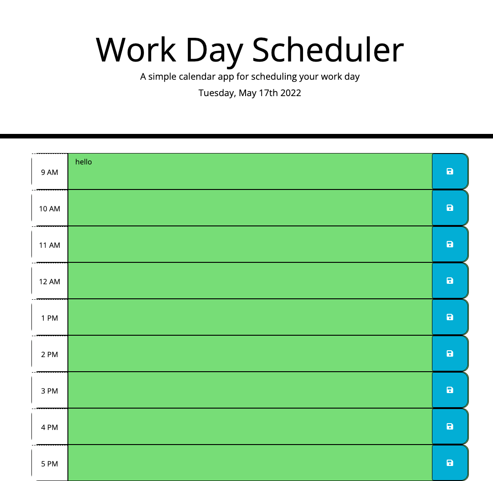

# Work Day Scheduler Starter Code

My objective for this Assignment was to make a work day calender that shows color coordinated past, present, and future time slots. in each time slot the user can save text by writing in the center then pressing the save button on the right.

INSTALLATION//

1. Download or clone repository
   2.Open the index.html on your browser to view webpage
2. Use a text editor to allow for complete code viewing

INSTRUCTIONS//

1. click in the blank center block to add messages.

2. after you have entered text click the floppy disk icon located to the right of the text block. this will allow you to save text into local storage.

